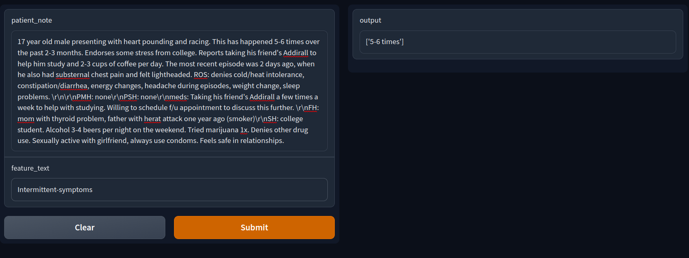

# Extracting Keyphrases from pn_notes
## Description
When you visit a doctor, how they interpret your symptoms can determine whether your diagnosis is accurate. By the time they’re licensed, physicians have had a lot of practice writing patient notes that document the history of the patient’s complaint, physical exam findings, possible diagnoses, and follow-up care. Learning and assessing the skill of writing patient notes requires feedback from other doctors, a time-intensive process that could be improved with the addition of machine learning.

## Results

| model_name                 | score  |
|:--------------------------:|:------:|
| bert-base-uncased          | 0.7762 |
| microsoft/deberta-base     | 0.8260 |
| roberta-large              | 0.8662 |
| microsoft/deberta-v3-large | **0.8733**|

## Example (Inference)
I deployed this model on Hugging Face - Spaces. You can play with this model here - [https://huggingface.co/spaces/arvind-nd/extracting-key-phrases](https://huggingface.co/spaces/arvind-nd/extracting-key-phrases).

